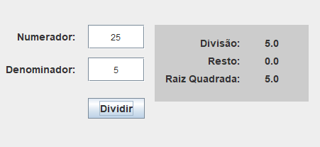

<h1> 🧮 Division, Rest and Square Root</h1>
<h3>🧙‍♀️ Author: Rafaela Mendonça Estefogo</h3>
<h3>📝 Language: Java</h3>
<h3>🖥️ IDE: NetBeans</h3>
<h3>📆 Date: 14/09/2023</h3>

<h3>Description:</h3>

The program calculates the division and the rest of the division of two numbers, and the square root of the numerator, as shown below:

 

